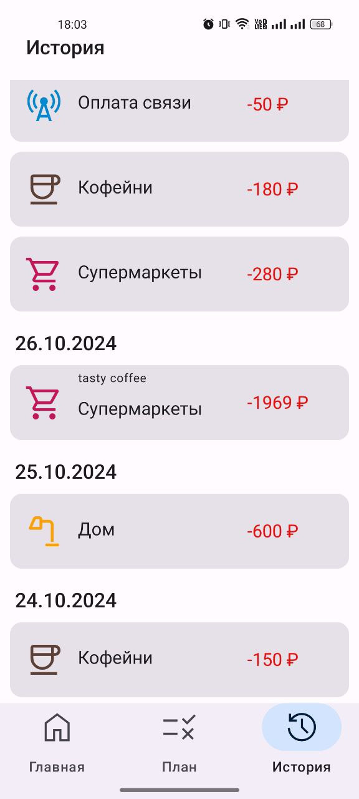

### _Mobile application for monitoring and planning expenses_

## Technology stack:
- Kotlin
- Coroutines
- Room
- Jetpack compose
- Junit 4 and Truth
- Preference DataStore

## Screenshots

### Fact and planned costs screen:

### Add cost screen:

### History screen:

### Add category screen:

